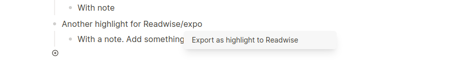

# logseq-readwise-reader-export

Send blocks to Readwise Reader as highlights.

## Features

- Export a block to Readwise.
- Export a block with a note to Readwise.
- Export a page to Reader
- Save an URL to Reader
- Fetch daily review from Readwise

## Functions

### Export blocks

You can send the current block as a highlight to Readwise with the 
slash command "Export as highlight to Readwise" or from the context menu
with "Export as highlight to Readwise".

The current block will be sent as the highlight and the first child block
as the note. When you send the same highlight multiple times, it will only
be saved once, because Readwise looks at the author, title, text combination
for a highlight. It updates the note when the note is send again later.
Formatting is not supported.

Highlights are created in a book with author and title from the plugin settings.



#### Create mastery flashcards

With `.qa` tag it is possible to create flashcards in Readwise directly from
Logseq. Normally highlights are on the line itself and the first child node is
sent as a note for the highlight.

With `.qa` tag you do this as well, but format the note itself in a special way.
Start with `.qa` press Shift+Enter, to add a new line, write your question,
Shift+Enter for a new line and add the answer of the flashcard. All combined
that will look like this:

```
- [highlight or other text]
  - .qa
    [question]
    [answer]
```

Real example:

```
- I just found how to create flashcards in Readwise with tags.
    - .qa
      How you can you create flashcards in Readwise from tags?
      With the .qa tag and a specially formatted note.
```

      

### Export page to Reader

Use the command palette "Export Page to Reader". When called the plugin will the
author from settings, a fake url (because logseq urls are not accepted), the
page title and the content blocks as paragraphs to Reader. The HTML the plugin
sends is very simple for now, but can be improved. Please provide feedback about
this in Discussions.

### Save URL to Reader

Use the command palette "Save URL to Reader" or the block context menu to Save
a URL to Reader.

### Fetch daily review

Use the slash command "Fetch daily review" to fetch today's review from Readwise.

## Settings

You can set the Readwise access token, author and book title.

## Author

Peter Stuifzand
